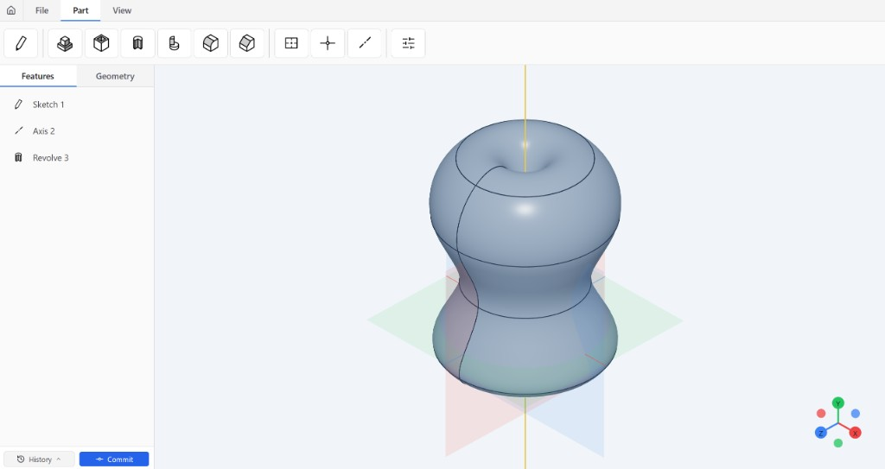
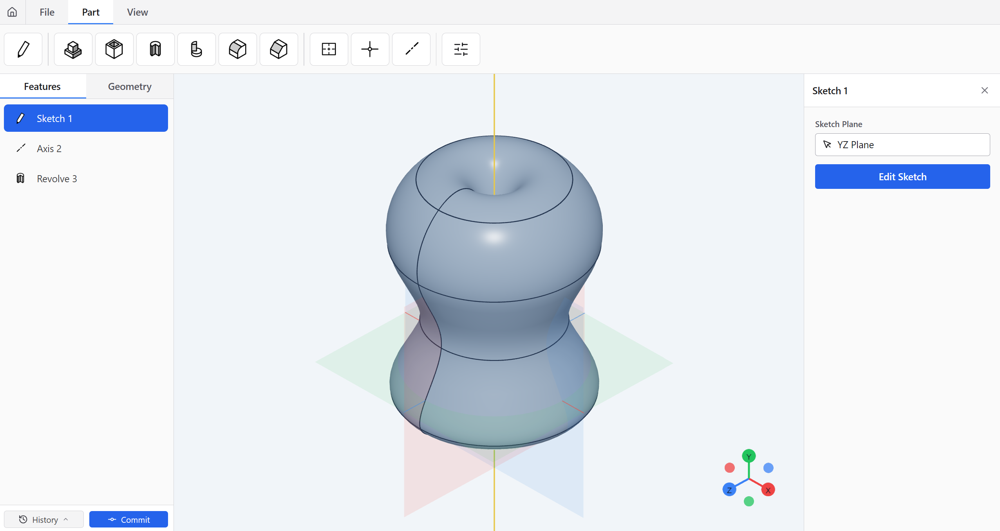
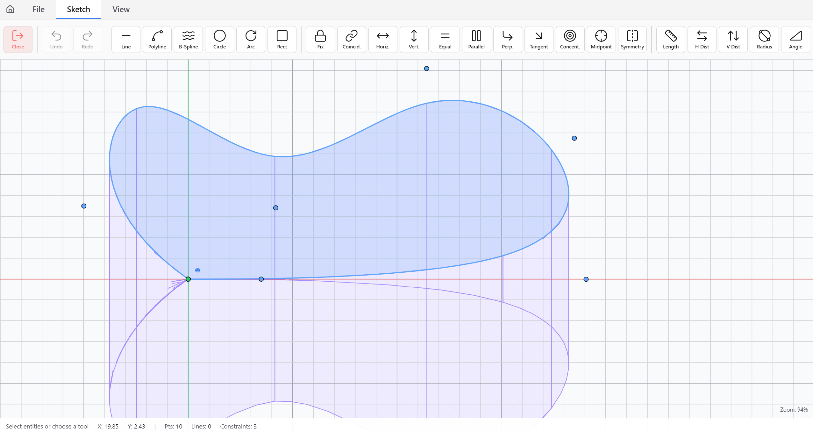

# 🧊 3dcad

Browser-based **parametric 3D CAD** in the vein of desktop modelers — parts, a feature tree, and a live **Three.js** viewport — powered by **Open CASCADE** via [**replicad**](https://replicad.xyz/) and **opencascade.js**.



## 🛠️ Features

- **Part workflow** — Parametric **feature tree** (sketches, reference geometry, solids) with a **Features** / **Geometry** sidebar; hide/show body pieces; rename, enable/disable, and edit features from the tree.
- **2D sketching** — Lines, polylines, **B-splines**, circles, arcs, rectangles; **constraints** (coincident, horizontal/vertical, parallel, perpendicular, tangent, symmetry, and more); **dimensions** (length, distances, radius, angle); construction (“auxiliary”) curves; sketch undo/redo.
- **Solids** — **Extrude**, **cut**, **revolve**, **revolve cut**, **fillet**, and **chamfer** with viewport picking for planes, edges, axes, and points where needed.
- **Reference geometry** — User **planes**, **points**, and **axes** for sketches and operations.
- **Parameters** — Global and dimension-driven values for driving the model.
- **3D viewport** — Shaded bodies with orbit controls, **XYZ gizmo**, optional grid, orthographic / perspective, and **standard views** (front, back, left, right, top, bottom, isometric).
- **Documents** — **Home** screen with **recent parts** and live thumbnails; rename, **Save As**, download **`.par`**, duplicate, **export STEP** and **STL**.
- **Local history** — **Commit** snapshots with messages and a **History** list to inspect and **restore** earlier states (browser-local, not a remote Git server).

## ✨ Stack

- **React 19** + **TypeScript** + **Vite**
- **@react-three/fiber** / **drei** + **Three.js** for the viewport
- **replicad** + **replicad-opencascadejs** for B-rep / solid modeling
- **Zustand** for state · **Tailwind CSS** for UI

## 🚀 Quick start

```bash
npm install
npm run dev
```

Then open the URL Vite prints (usually `http://localhost:5173`).

| Command        | Action              |
|----------------|---------------------|
| `npm run dev`  | Dev server + HMR    |
| `npm run build`| Typecheck + production build |
| `npm run preview` | Serve `dist` locally |
| `npm run lint` | ESLint              |

## 📁 Notes

- **`assemble2d`** is pulled from GitHub (`tab58/assemble2d`); ensure network access on first install.
- This is a **private** app (`"private": true` in `package.json`).

---


## Screenshots






*Built with ⚡ Vite*
